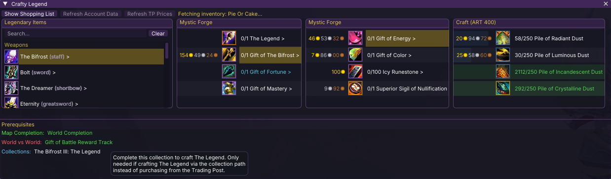
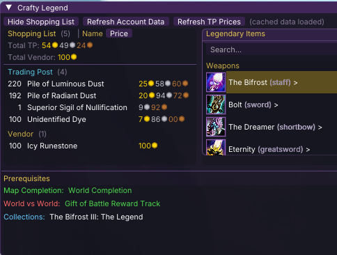

# Crafty Legend

A Guild Wars 2 addon for [Raidcore Nexus](https://raidcore.gg/Nexus) that provides a comprehensive crafting tracker for all legendary equipment.

## AI Notice

This addon has been 100% created in [Windsurf](https://windsurf.com/) using Claude. I understand that some folks have a moral, financial or political objection to creating software using an LLM. I just wanted to make a useful tool for the GW2 community, and this was the only way I could do it.

## Screenshots

### Crafting Tree


### Shopping List


## Features

- **117 legendaries** with complete crafting trees
- Miller column UI (Like Mac OSX Finder) for navigating crafting trees
- GW2 API integration for tracking owned materials, wallet currencies, masteries, and achievements
- Trading Post and vendor gold prices from GW2 API
- Vendor cost details with vendor names and currency requirements
- Achievement and collection prerequisite tracking
- Persistent account data and price caching

## Building

### Prerequisites

- CMake 3.20+
- MinGW cross-compiler (`x86_64-w64-mingw32-gcc`, `x86_64-w64-mingw32-g++`)

### Build Commands

```bash
mkdir build && cd build
cmake ..
make
```

The build produces `CraftyLegend.dll` and copies the data JSON files alongside it.

## Installation

1. Install [Raidcore Nexus](https://raidcore.gg/Nexus) for Guild Wars 2
2. Copy `CraftyLegend.dll` to your Nexus addons directory
3. Copy the `CraftyLegend/` data folder alongside the DLL
4. Launch GW2 — toggle the window with `Ctrl+Shift+L`

## Project Structure

```
crafty_legend/
├── CMakeLists.txt              # Build configuration
├── CraftyLegend.def            # DLL export definitions
├── include/nexus/Nexus.h       # Nexus API header
├── lib/
│   ├── imgui/                  # Dear ImGui (bundled)
│   └── nlohmann/               # nlohmann/json (bundled)
├── src/
│   ├── dllmain_hotkey.cpp      # DLL entry point, UI rendering, addon lifecycle
│   ├── DataManager.h/cpp       # Item/recipe/legendary data, vendor handlers, prereqs
│   └── GW2API.h/cpp            # API key, account data, TP prices, persistence
├── data/CraftyLegend/
│   ├── items.json              # 971 items with acquisition methods
│   ├── recipes.json            # 499 recipes (crafting + Mystic Forge)
│   ├── legendaries.json        # 117 legendary definitions
│   └── currencies.json         # Currency database
├── scripts/                    # Data generation/verification scripts (Python)
└── docs/                       # Documentation
```

## Data Format

All data uses GW2 API item IDs internally. The JSON data files are the source of truth for crafting trees and are loaded at runtime. User data (API key, account data, TP prices) is saved to the same directory and excluded from version control.

## License

This project is provided as-is for educational and personal use.
