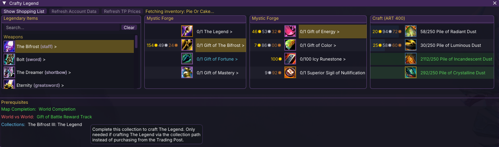
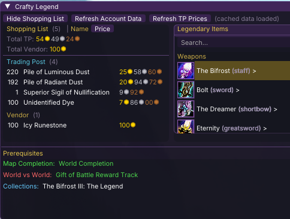

# Crafty Legend

A [Raidcore Nexus](https://raidcore.gg/Nexus) addon for Guild Wars 2 that tracks crafting progress for all legendary equipment.

## AI Notice

This addon has been largely created using Claude. I understand that some folks have a moral, financial or political objection to creating software using an LLM. I just wanted to make a useful tool for the GW2 community, and this was the only way I could do it.

If an LLM creating software upsets you, then perhaps this repo isn't for you. Move on, and enjoy your day.

## Screenshots




## Features

- Full crafting trees for all legendary weapons, armour, trinkets, and back items
- Miller column UI for navigating acquisition paths and material breakdowns
- Progress bars showing how close you are to completion
- **Shopping list** — aggregates all needed materials, with TP prices, vendor costs, and coin totals
- **Multi-account support** — detects the active account via MumbleLink; account-bound items show per-account counts, unbound items total across all accounts
- **Favourites** — star any legendary to pin it to a section at the top of the list
- Search bar for quickly finding any legendary
- Right-click any legendary or material to open it on the wiki or look it up in Hoard & Seek
- Achievement and mastery prerequisite tracking
- Item icons with rarity borders, owned badges, and TP price tooltips

## Requirements

- [Raidcore Nexus](https://raidcore.gg/Nexus)
- [Hoard & Seek](https://github.com/PieOrCake/hoard_and_seek) (v3+) — provides all account data (inventory, wallet, legendary armory, achievements, masteries). No GW2 API key needed in Crafty Legend itself.

## Installation

1. Install [Raidcore Nexus](https://raidcore.gg/Nexus)
2. Install **Hoard & Seek** from the Nexus addon library or from [GitHub](https://github.com/PieOrCake/hoard_and_seek)
3. Copy `CraftyLegend.dll` to your Nexus addons folder
4. Launch GW2 — open with `Ctrl+Shift+L` or the anvil icon in the Quick Access toolbar

## Building

Requires CMake 3.20+ and the MinGW cross-compiler (`x86_64-w64-mingw32-g++`).

```bash
mkdir build && cd build
cmake ..
make
```

Output: `build/CraftyLegend.dll`

## License

[MIT License](LICENSE)

## Third-Party Notices

- **[Dear ImGui](https://github.com/ocornut/imgui)** — MIT License, Copyright (c) 2014-2021 Omar Cornut
- **[nlohmann/json](https://github.com/nlohmann/json)** — MIT License, Copyright (c) 2013-2025 Niels Lohmann
- **[Nexus API](https://raidcore.gg/Nexus)** — MIT License, Copyright (c) Raidcore.GG
